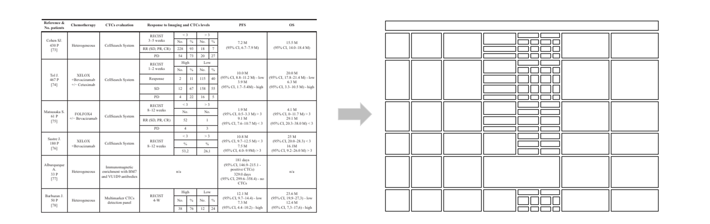

## Table CV

Table-CV is an OpenCV-based table cell detection tool. It can be used to detect table cells in images with explicit row and column lines, making it useful for preprocessing table Optical Character Recognition (OCR) tasks. The core concept involves detecting horizontal and vertical lines in images using the Hough Transform. Subsequently, cell pairs without any lines separating them are merged. Compared to deep learning-based methods, this tool offers several advantages:

* **Higher Accuracy in Cell Coordinates**: Table-CV achieves greater precision in determining the coordinates of table cells.
* **Hardware Friendliness**: It requires less computational resources compared to deep learning approaches.
* **Preserved Cell Relationships**: Most importantly, Table-CV retains the relationships between cells, meaning the overall structure of the table is maintained.

 However, **it is not intented to be used in tables detection without explicit lines or colorful tables.** Please refer to [table-transformer](https://github.com/microsoft/table-transformer) instead.

